# MATERNAL DEATH DURING CHILDBIRTH - DATA VISUALIZATION

## Abstract
Pregnancy related deaths are a comparatively rare occurance. Worldwide, maternal mortality rate fell by almost half from 1990 to 2015. Yet, the rate in the United States had increased by more than 25 percent. Reducing maternal death during childbirth requires in-depth examination of isolated causes of death. Seeking to find impact of big data analytics in maternal death during childbirth. Looking for patterns to predict who's susceptible to fatality and preventable factors. Exploring methods of extracting the data and converting to data visualization by using variety of Python libraries in Jupiter Notebook.

## Introduction
Maternity deaths are rising for unclear reasons in United States. USA is the only developed nation where that rate is increasing and it is only getting worse. American women are more likely to die from childbirth than women in any other high developed country. Meanwhile, fertility rate getting lower. The number of women giving birth has been declining for years and recentley hit a historic low [1]. It is hard to understand the relationship between declining birthrates and rising maternal deaths and logically does not make sence.

Based on research and analysis by the Center for Disease Control and Prevention [2], maternal death greatly increased and more than half of such incidents could have been prevented with the current medical technologies. Most of the cases were result of medical errors, neglegence and unprepared hospitals. Doctor’s ability to protect the health of mothers in child-birth is a basic measure of a society's development. Yet, every year in the United States 700 to 900 women die from pregnancy or childbirth-related causes; and some 65,000 nearly die. It is by many measures, the worst record in the developed world [3]. We have ability to prevent it, by analyzing each cause and utilize monitoring to predict cases and usage of the Big Data and Analytics. Statistical research for 2011 put America in the 50th place; the lowest of all developed nations for maternal death during childbirth [4].

## Background And Related Work
World Health Organization, UnData and American's Health Rankings made some statistical data available to public to support and contribute of the review and analysis.

Over 200 healthcare applications and tools were developed since 2010. Number of healthcare providers have already benefited from big data by concentrating on the fundamental structure of the big data and visualization tools. For example, Kaiser Permanente adapted new system called HealthConnect, it communicates new data between collected information about patients and treatments. The implemented system have helped to save more than one billion dollars from lowering patients visits to doctor's office. Another example would be the Blue Shield of California adapted NantHealth and improved outcomes for patients and hospitals by communicating information about the visits, patient health history. It helped to provide most effective and less expensive treatments for chronicle illness with preventive care and communications between doctors and patients [5]. 

Furthermore, The Lancet Journal done similar study on October 8, 2016 that called ”Global, regional, and national levels of maternal mortality, 1990-2015: a systematic analysis for the Global Burden of Disease Study 2015” [6]. They used a standardized process to identify, extract and process all relevant data sources. Uniformed algorithms were applied to identify age category, year category, and location specific patterns of failure and hidden records for vital registration, as well as patterns of deaths misrepresentation. As shown in the Figure 1 below, they visualized the data by using line plots, scatter plots, choropleth maps and contour.


```python
from IPython.display import Image
from IPython.core.display import HTML 
Image(url= "lancet_figure1.jpg")
```


Also, Centers For Disease Control and Prevention established national surveillance of pregnancy-related deaths. Each year, CDC requests the 52 reporting areas (50 states, New York City, and Washington DC) to voluntarily send copies of death certificates for all women who died during pregnancy [7]. Centers for Disease Control and Prevention Maternal Mortality Study Group analyzes the data and provides report periodically through their literature and website. As shown in Figure 2, they published trends in pregnancy related deaths by using visualization methods such as line plots, time series and bar charts. 


```python
Image(url= "figure2.jpg")
```


Even thoughts, there is a lot of data that was being visualized, it is unclear what conclusions can be drawn from the graphs. Lack of details, not enough information about each state, correlation, women’s health and condition. 

## Research Questions
Comparing and analysing women's health, reproduction, maternal deaths trend and health standard of living within each state might reveal the reasoning behind increased maternity death and related causes. Finding leading potential factors and exploring further. Additionally, perform variety of methods in data visualization tools with Python within Jupiter Notebook that would help to present the information in informative and simple way for human visual processing and undestanding the alarming statistics.

## Process
The workflow for the project involved Jupyter Notebook for data analysis, generating the figures and running different Python visualization tools.
Latest tools allow to utilize Python to cross mix and match different values and data sets to analyze complex data; and visualize it by rendering correlations and trends. It reveals stunning insights about each state and trends.
Python world has been around for thirty years and a lot of code was written with multiple contributors.

The most common types of visualization are simple bar chart, line graphs, scatter plots and choropleth map. These are the most popular and commonly used types of visualization to make comparison between values and varieties of categories. Parameters were identified, such as axes, similarities, titles and decided on what exactly the visualization supposed to represent.

To create the visualizations some of the most popular tools and libraries that have been used. These include the highly used and common tools such as: Pandas, Seaborn, Bokeh,  Pygal and Ploty.

The data-sets collected from https://data.worldbank.org and https://www.americashealthrankings.org and also uploaded to the github to demonstrate the trends and patterns between each output. 
The data involves geographic locations, health conditions, and ratings by years, by states, ethnicity and gender.

Certain methods didn't yield successful results. For example visualizing percentages of prenetal care within each state by plotting data with bar chart provided unclear visualization due to a very small difference between states and large percentage of visits. Also, when comparing large amount of data with high values versus small values, can be misprepresented as it makes it look like an even line without variations for the data with small values. As shown in Figure 3, when maternal mortality was compared with infant mortality versus chlamydia cases, it only emphasised the last variable. Therefore when comparing data, it needs to have values within approximately same range. Also, when drawing statistics from all years and countries together it becomes unlclear and creates weird patterns.


```python
Image(url= "figure3.jpg")
```


The best methods worked by comparing 1-7 categories of similar leading factors on one axis and the other axis for the ratio. Additionally, using colors and sizes to differentiate variables.


## Results and Insights
To start, the most basic method was being used by importing pandas,numpy, matplotlib import style, pyplot and ggplot.


```python
import pandas as pd
import numpy as np
from matplotlib import style
from matplotlib import pyplot as plt
%matplotlib inline
style.use('ggplot')
```

Then, the world maternal mortality data-sets was pulled from a CSV file, by usage of the reader function to generate a reader object. It took each line of the file and made a list of all columns. Then, chosen columns were excecuted.
Below is the result.


```python
#code
maternal_mortality = pd.read_csv('maternal_mortality.csv')
maternal_mortality = maternal_mortality.drop('Indicator Code', axis=1)
maternal_mortality = maternal_mortality.drop('Indicator Name', axis=1)
maternal_mortality.head()
```


<div>
<style>
    .dataframe thead tr:only-child th {
        text-align: right;
    }

    .dataframe thead th {
        text-align: left;
    }

    .dataframe tbody tr th {
        vertical-align: top;
    }
</style>
<table border="1" class="dataframe">
  <thead>
    <tr style="text-align: right;">
      <th></th>
      <th>Country Name</th>
      <th>1990</th>
      <th>1991</th>
      <th>1992</th>
      <th>1993</th>
      <th>1994</th>
      <th>1995</th>
      <th>1996</th>
      <th>1997</th>
      <th>1998</th>
      <th>...</th>
      <th>2008</th>
      <th>2009</th>
      <th>2010</th>
      <th>2011</th>
      <th>2012</th>
      <th>2013</th>
      <th>2014</th>
      <th>2015</th>
      <th>2016</th>
      <th>2017</th>
    </tr>
  </thead>
  <tbody>
    <tr>
      <th>0</th>
      <td>Afghanistan</td>
      <td>1340.0</td>
      <td>1330.0</td>
      <td>1330.0</td>
      <td>1320.0</td>
      <td>1300.0</td>
      <td>1270.0</td>
      <td>1240.0</td>
      <td>1200.0</td>
      <td>1160.0</td>
      <td>...</td>
      <td>676.0</td>
      <td>631.0</td>
      <td>584.0</td>
      <td>536.0</td>
      <td>496.0</td>
      <td>459.0</td>
      <td>425.0</td>
      <td>396.0</td>
      <td>NaN</td>
      <td>NaN</td>
    </tr>
    <tr>
      <th>1</th>
      <td>Angola</td>
      <td>1160.0</td>
      <td>1160.0</td>
      <td>1180.0</td>
      <td>1180.0</td>
      <td>1180.0</td>
      <td>1150.0</td>
      <td>1120.0</td>
      <td>1070.0</td>
      <td>1030.0</td>
      <td>...</td>
      <td>606.0</td>
      <td>581.0</td>
      <td>561.0</td>
      <td>546.0</td>
      <td>526.0</td>
      <td>509.0</td>
      <td>493.0</td>
      <td>477.0</td>
      <td>NaN</td>
      <td>NaN</td>
    </tr>
    <tr>
      <th>2</th>
      <td>Albania</td>
      <td>71.0</td>
      <td>69.0</td>
      <td>65.0</td>
      <td>63.0</td>
      <td>49.0</td>
      <td>53.0</td>
      <td>50.0</td>
      <td>51.0</td>
      <td>46.0</td>
      <td>...</td>
      <td>30.0</td>
      <td>30.0</td>
      <td>30.0</td>
      <td>30.0</td>
      <td>30.0</td>
      <td>29.0</td>
      <td>29.0</td>
      <td>29.0</td>
      <td>NaN</td>
      <td>NaN</td>
    </tr>
    <tr>
      <th>3</th>
      <td>Andorra</td>
      <td>NaN</td>
      <td>NaN</td>
      <td>NaN</td>
      <td>NaN</td>
      <td>NaN</td>
      <td>NaN</td>
      <td>NaN</td>
      <td>NaN</td>
      <td>NaN</td>
      <td>...</td>
      <td>NaN</td>
      <td>NaN</td>
      <td>NaN</td>
      <td>NaN</td>
      <td>NaN</td>
      <td>NaN</td>
      <td>NaN</td>
      <td>NaN</td>
      <td>NaN</td>
      <td>NaN</td>
    </tr>
    <tr>
      <th>4</th>
      <td>Arab World</td>
      <td>289.0</td>
      <td>285.0</td>
      <td>281.0</td>
      <td>278.0</td>
      <td>274.0</td>
      <td>269.0</td>
      <td>264.0</td>
      <td>258.0</td>
      <td>251.0</td>
      <td>...</td>
      <td>186.0</td>
      <td>180.0</td>
      <td>174.0</td>
      <td>170.0</td>
      <td>166.0</td>
      <td>163.0</td>
      <td>159.0</td>
      <td>156.0</td>
      <td>NaN</td>
      <td>NaN</td>
    </tr>
  </tbody>
</table>
<p>5 rows × 29 columns</p>
</div>


After that, the data was being visually displayed by using horizontal bar chart method, as shown in Figure 4. Two categories were being compared, data in 1990 versus data in 2015, nationwide. Even thought the y axis with countries overlapping each other and looks messy, it shows that worldwide, overall maternal mortality rate significantly dropped from 1900 to 2015. Red color represents data in 1900 versus blue color represents data in 2015.


```python
#fig4
objects = (maternal_mortality['Country Name'])
y_pos = np.arange(len(objects))
width = .5

year_1990 = sorted(maternal_mortality['1990'])
year_2015 = sorted(maternal_mortality['2015'])


plt.figure(figsize=(10,10))

plt.barh(y_pos +width, year_1990, align='center',  label='1990')
plt.barh(y_pos +width, year_2015, align='center',  label='2015')


plt.yticks(y_pos, objects, fontsize='small')
plt.xlabel('Percentage')
plt.title('FIGURE 4. Maternal Death Worldwide in 1990 vs 2015.')

plt.legend()

plt.show()
```


Next, the data-set was modified, to compare the change in maternal rate between six completly different countries, which were Australia, United States, Uzbekistan, Uruguay, Afganistan and middle class world average. The code below automatically displays the table.


```python
#code
compared_usa_mortality_rate = maternal_mortality[247:250]
world_mortality = maternal_mortality[256:257]
australia = maternal_mortality[10:11]
afganistan = maternal_mortality[0:1]
compared_mortality = compared_usa_mortality_rate.append(world_mortality).append(australia).append(afganistan)
compared_mortality
```


<div>
<style>
    .dataframe thead tr:only-child th {
        text-align: right;
    }

    .dataframe thead th {
        text-align: left;
    }

    .dataframe tbody tr th {
        vertical-align: top;
    }
</style>
<table border="1" class="dataframe">
  <thead>
    <tr style="text-align: right;">
      <th></th>
      <th>Country Name</th>
      <th>1990</th>
      <th>1991</th>
      <th>1992</th>
      <th>1993</th>
      <th>1994</th>
      <th>1995</th>
      <th>1996</th>
      <th>1997</th>
      <th>1998</th>
      <th>...</th>
      <th>2008</th>
      <th>2009</th>
      <th>2010</th>
      <th>2011</th>
      <th>2012</th>
      <th>2013</th>
      <th>2014</th>
      <th>2015</th>
      <th>2016</th>
      <th>2017</th>
    </tr>
  </thead>
  <tbody>
    <tr>
      <th>247</th>
      <td>Uruguay</td>
      <td>37.0</td>
      <td>41.0</td>
      <td>36.0</td>
      <td>37.0</td>
      <td>36.0</td>
      <td>36.0</td>
      <td>33.0</td>
      <td>33.0</td>
      <td>33.0</td>
      <td>...</td>
      <td>20.0</td>
      <td>20.0</td>
      <td>19.0</td>
      <td>17.0</td>
      <td>16.0</td>
      <td>16.0</td>
      <td>15.0</td>
      <td>15.0</td>
      <td>NaN</td>
      <td>NaN</td>
    </tr>
    <tr>
      <th>248</th>
      <td>United States</td>
      <td>12.0</td>
      <td>12.0</td>
      <td>12.0</td>
      <td>12.0</td>
      <td>12.0</td>
      <td>12.0</td>
      <td>11.0</td>
      <td>11.0</td>
      <td>11.0</td>
      <td>...</td>
      <td>14.0</td>
      <td>15.0</td>
      <td>14.0</td>
      <td>14.0</td>
      <td>14.0</td>
      <td>14.0</td>
      <td>14.0</td>
      <td>14.0</td>
      <td>NaN</td>
      <td>NaN</td>
    </tr>
    <tr>
      <th>249</th>
      <td>Uzbekistan</td>
      <td>54.0</td>
      <td>51.0</td>
      <td>45.0</td>
      <td>42.0</td>
      <td>37.0</td>
      <td>32.0</td>
      <td>31.0</td>
      <td>29.0</td>
      <td>30.0</td>
      <td>...</td>
      <td>40.0</td>
      <td>40.0</td>
      <td>39.0</td>
      <td>38.0</td>
      <td>38.0</td>
      <td>37.0</td>
      <td>37.0</td>
      <td>36.0</td>
      <td>NaN</td>
      <td>NaN</td>
    </tr>
    <tr>
      <th>256</th>
      <td>World</td>
      <td>385.0</td>
      <td>381.0</td>
      <td>378.0</td>
      <td>375.0</td>
      <td>372.0</td>
      <td>369.0</td>
      <td>366.0</td>
      <td>361.0</td>
      <td>356.0</td>
      <td>...</td>
      <td>258.0</td>
      <td>254.0</td>
      <td>246.0</td>
      <td>237.0</td>
      <td>232.0</td>
      <td>226.0</td>
      <td>221.0</td>
      <td>216.0</td>
      <td>NaN</td>
      <td>NaN</td>
    </tr>
    <tr>
      <th>10</th>
      <td>Australia</td>
      <td>8.0</td>
      <td>8.0</td>
      <td>8.0</td>
      <td>8.0</td>
      <td>8.0</td>
      <td>8.0</td>
      <td>8.0</td>
      <td>9.0</td>
      <td>8.0</td>
      <td>...</td>
      <td>7.0</td>
      <td>7.0</td>
      <td>6.0</td>
      <td>7.0</td>
      <td>6.0</td>
      <td>6.0</td>
      <td>6.0</td>
      <td>6.0</td>
      <td>NaN</td>
      <td>NaN</td>
    </tr>
    <tr>
      <th>0</th>
      <td>Afghanistan</td>
      <td>1340.0</td>
      <td>1330.0</td>
      <td>1330.0</td>
      <td>1320.0</td>
      <td>1300.0</td>
      <td>1270.0</td>
      <td>1240.0</td>
      <td>1200.0</td>
      <td>1160.0</td>
      <td>...</td>
      <td>676.0</td>
      <td>631.0</td>
      <td>584.0</td>
      <td>536.0</td>
      <td>496.0</td>
      <td>459.0</td>
      <td>425.0</td>
      <td>396.0</td>
      <td>NaN</td>
      <td>NaN</td>
    </tr>
  </tbody>
</table>
<p>6 rows × 29 columns</p>
</div>


Once the data visible within the table, it is very simple to create a quick bar chart plot. Vertical bar chart method in Figure 5 shows that even in Afganistan, which is an extremly poor country, maternal death rates dropped by 75 percent. 


```python
#fig5

year_1990=compared_mortality['1990']
year_2015=compared_mortality['2015']


n_groups = 6

plt.figure(figsize=(10,10))


index = np.arange(n_groups)
bar_width = 0.35

opacity = 0.4
error_config = {'ecolor': '0.3'}


rects1 = plt.bar(index, year_1990, bar_width,
                 alpha=opacity,
                 error_kw=error_config,
                 label='1990')

rects2 = plt.bar(index + bar_width, year_2015, bar_width,
                 alpha=opacity,
                 error_kw=error_config,
                 label='2015')


plt.ylabel('Mortality Rate per 100,000 Live Births')
plt.title('FIGURE 5. Maternal Mortality Rates, 1990 vs 2015')
plt.xticks(index + bar_width / 2, ('Uruguay' , 'United States',  'Uzbekistan', 'World', 'Australia', 'Afghanistan'))
plt.legend()

plt.tight_layout()
plt.show()
```


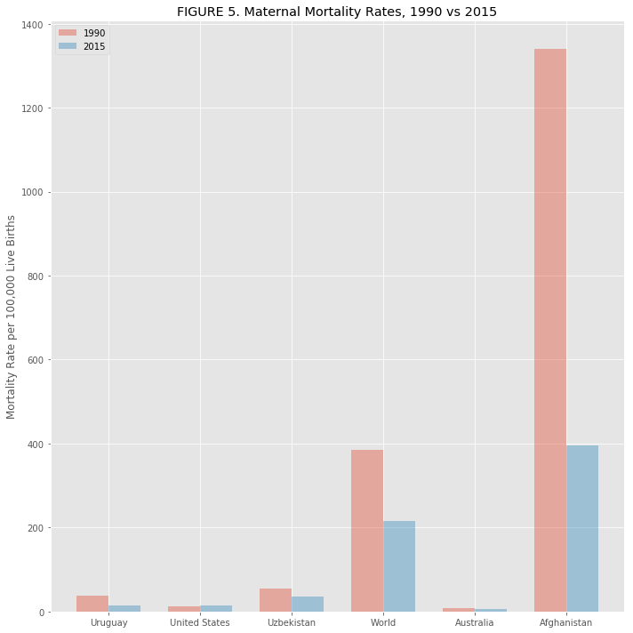


Unfortunately this did not show much information about United States or Australia. With a few tweaks and running 3 countries, it looked a little more impactful. The code and the plotted chart is below. As shown in Figure 6, United States maternal mortality rate increased, meanwhile other countries decreased. 


```python
#code
usa_mortality_rate = maternal_mortality[248:249]
uzbekistan = maternal_mortality[249:250]
compared_mortality = usa_mortality_rate.append(australia).append(uzbekistan)
compared_mortality
```


<div>
<style>
    .dataframe thead tr:only-child th {
        text-align: right;
    }

    .dataframe thead th {
        text-align: left;
    }

    .dataframe tbody tr th {
        vertical-align: top;
    }
</style>
<table border="1" class="dataframe">
  <thead>
    <tr style="text-align: right;">
      <th></th>
      <th>Country Name</th>
      <th>1990</th>
      <th>1991</th>
      <th>1992</th>
      <th>1993</th>
      <th>1994</th>
      <th>1995</th>
      <th>1996</th>
      <th>1997</th>
      <th>1998</th>
      <th>...</th>
      <th>2008</th>
      <th>2009</th>
      <th>2010</th>
      <th>2011</th>
      <th>2012</th>
      <th>2013</th>
      <th>2014</th>
      <th>2015</th>
      <th>2016</th>
      <th>2017</th>
    </tr>
  </thead>
  <tbody>
    <tr>
      <th>248</th>
      <td>United States</td>
      <td>12.0</td>
      <td>12.0</td>
      <td>12.0</td>
      <td>12.0</td>
      <td>12.0</td>
      <td>12.0</td>
      <td>11.0</td>
      <td>11.0</td>
      <td>11.0</td>
      <td>...</td>
      <td>14.0</td>
      <td>15.0</td>
      <td>14.0</td>
      <td>14.0</td>
      <td>14.0</td>
      <td>14.0</td>
      <td>14.0</td>
      <td>14.0</td>
      <td>NaN</td>
      <td>NaN</td>
    </tr>
    <tr>
      <th>10</th>
      <td>Australia</td>
      <td>8.0</td>
      <td>8.0</td>
      <td>8.0</td>
      <td>8.0</td>
      <td>8.0</td>
      <td>8.0</td>
      <td>8.0</td>
      <td>9.0</td>
      <td>8.0</td>
      <td>...</td>
      <td>7.0</td>
      <td>7.0</td>
      <td>6.0</td>
      <td>7.0</td>
      <td>6.0</td>
      <td>6.0</td>
      <td>6.0</td>
      <td>6.0</td>
      <td>NaN</td>
      <td>NaN</td>
    </tr>
    <tr>
      <th>249</th>
      <td>Uzbekistan</td>
      <td>54.0</td>
      <td>51.0</td>
      <td>45.0</td>
      <td>42.0</td>
      <td>37.0</td>
      <td>32.0</td>
      <td>31.0</td>
      <td>29.0</td>
      <td>30.0</td>
      <td>...</td>
      <td>40.0</td>
      <td>40.0</td>
      <td>39.0</td>
      <td>38.0</td>
      <td>38.0</td>
      <td>37.0</td>
      <td>37.0</td>
      <td>36.0</td>
      <td>NaN</td>
      <td>NaN</td>
    </tr>
  </tbody>
</table>
<p>3 rows × 29 columns</p>
</div>


```python
#fig6

year_1990=compared_mortality['1990']
year_2015=compared_mortality['2015']


n_groups = 3

plt.figure(figsize=(10,10))

index = np.arange(n_groups)

bar_width = 0.35

opacity = 0.4

rects1 = plt.bar(index, year_1990, bar_width,
                 alpha=opacity,
                 error_kw=error_config,
                 label='1990')
rects2 = plt.bar(index + bar_width, year_2015, bar_width,
                 alpha=opacity,
                 error_kw=error_config,
                 label='2015')

plt.ylabel('Mortality Rate per 100,000 Live Births')
plt.title('FIGURE 6. Maternal Mortality Rates, 1990 vs 2015.')
plt.xticks(index + bar_width / 2, ('United States','Australia', 'Uzbekistan'))
plt.legend()

plt.tight_layout()
plt.show()
```


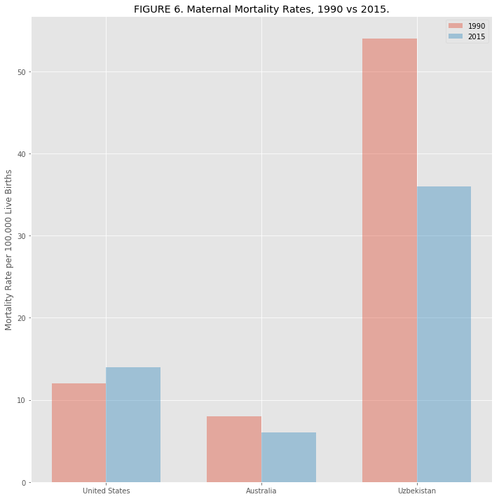


Then, the maternal mortality rate in United States was broked down by years, from 1990 to 2015. A simple line plot method was used. As shown in Figure 7, the rate was decreased in 1995 and then significantly increased in 2010.


```python
#fig7

x = ['1990','1991','1992','1993','1994','1995','1996','1997','1998','1999','2000','2001','2002','2003','2004','2005','2006','2007','2008','2009','2010','2011','2012','2013','2014','2015']
y =['12','12','12' ,'12' ,'12' ,'12' , '11',  '11',  '11', '12', '12', '13','13','13','13','13', '14',  '14', '14', '14','15', '14', '14',  '14',  '14',  '14']
plt.figure(figsize=(10,10))

plt.plot(x,y)


plt.ylabel('Mortality Rate per 100,000 Live Births')
plt.xlabel('United States')
plt.title('FIGURE 7. Maternal Mortality Rates, USA, 1990–2015.')
plt.show()
```


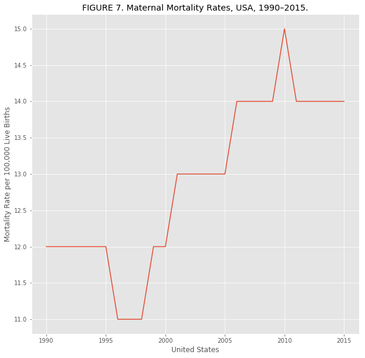


Based on the world mortality rate data, there was not enought data to compare in earlier years. Some countries started as early as 1800, meanwhile other countries only have data since 1990. To undestand the density of data in the file by years, the scatter plot graph was executed below. As shown in Figure 8, there was lack of information and increased data was supplied from around 1990.


```python
#fig8

world_death=pd.read_csv("maternal_world_death.csv")
world_death_year = world_death['Year']
world_death_country =  world_death['Entity']
world_death_ratio = world_death["Maternal Mortality Ratio (Gapminder and World Bank) (deaths per 100,000 live births)"]

x = world_death_year
y = world_death_ratio

plt.figure(figsize=(10,10))


plt.scatter(x,y, label='data', color='k', s=25, marker="o")

plt.xlabel('Years')
plt.ylabel('Amount of Data')
plt.title('FIGURE 8. Maternal Mortality Data.')
plt.legend()
plt.show()
```


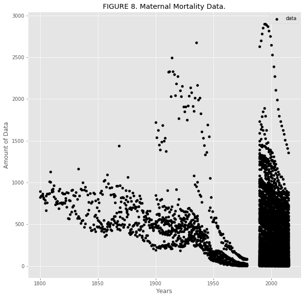


To undestand how much data was provided in comparison to other countries, the file was modified with isolated cases of 5 countries, Afghanistan, Australia, Sweden, Zimbabwe and USA. Another scatter plot was excecuted, with color adjusted by country and size based on amount of data supplied. As shown the the Figre 9, Sweden showing the biggest circle, while Afganistan showing the smallest circle. That means that Sweden provided much more information about mortality rate throughout the years than other countries.


```python
#code
city_death_Afghanistan = world_death[0:26]
city_death_Australia = world_death[182:286]
city_death_Zimbabwe =  world_death[7060:7086]
city_death_Sweden = world_death[5965:6171]
city_death_usa = world_death[6720:6826]
Afghanistan = city_death_Afghanistan ['Year'].count()
Australia = city_death_Australia['Year'].count()
sweden = city_death_Sweden['Year'].count()
Zimbabwe = city_death_Zimbabwe['Year'].count()
usa = city_death_usa['Year'].count()
```


```python
#fig9

n_groups = 5
index = np.arange(n_groups)
x = ('1', '2', '3', '4', '5')
y = ((Afghanistan), (Australia), (sweden), (Zimbabwe), (usa))
t = np.arange(5)
plt.figure(figsize=(10,10))
plt.scatter(x, y, c = t, s = y)
plt.xlabel('Countries')
plt.ylabel('Amount of Total Data')
bar_width = 2
plt.title('FIGURE 9. Maternal Death Data Count.')
plt.xticks(index + bar_width / 2, ('Afghanistan','Australia', 'Sweden', 'Zimbabwe', 'USA' ))

plt.show
```


    <function matplotlib.pyplot.show>


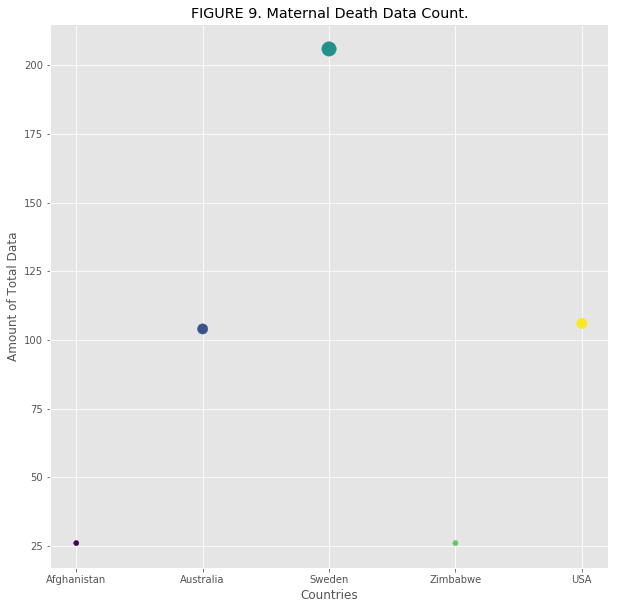


Worldwide fertility rate was compared next. Again, the file was modified by combining 3 variables. World's middle rate, United States rate, and countries with upper middle income. As shown in Figure 10, horizontal bar chart was created with transparent bars for easear comparison between variables. The chart showed that fertility rate dropped worldwide between 1990 and 2015. Fertility rate in United States significantly decreased compared to other countries, it declined by 30 percent.


```python
#code
fertility_rate = pd.read_csv('fertility_rate.csv')
fertility_rate = fertility_rate.drop('Indicator Code', axis=1)
fertility_rate = fertility_rate.drop('Indicator Name', axis=1)
fertility_rate_world = fertility_rate [257:258]
fertility_rate_usa = fertility_rate [249:250]
fertility_rate_upper_middle_income = fertility_rate [247:248]
fertility_rate_comparison = fertility_rate_world.append(fertility_rate_usa).append(fertility_rate_upper_middle_income)
fertility_rate_comparison
```


<div>
<style>
    .dataframe thead tr:only-child th {
        text-align: right;
    }

    .dataframe thead th {
        text-align: left;
    }

    .dataframe tbody tr th {
        vertical-align: top;
    }
</style>
<table border="1" class="dataframe">
  <thead>
    <tr style="text-align: right;">
      <th></th>
      <th>Country Name</th>
      <th>Country Code</th>
      <th>1960</th>
      <th>1961</th>
      <th>1962</th>
      <th>1963</th>
      <th>1964</th>
      <th>1965</th>
      <th>1966</th>
      <th>1967</th>
      <th>...</th>
      <th>2008</th>
      <th>2009</th>
      <th>2010</th>
      <th>2011</th>
      <th>2012</th>
      <th>2013</th>
      <th>2014</th>
      <th>2015</th>
      <th>2016</th>
      <th>2017</th>
    </tr>
  </thead>
  <tbody>
    <tr>
      <th>257</th>
      <td>World</td>
      <td>WLD</td>
      <td>86.626011</td>
      <td>86.441350</td>
      <td>85.927948</td>
      <td>84.590661</td>
      <td>83.314053</td>
      <td>82.209513</td>
      <td>81.192750</td>
      <td>80.295473</td>
      <td>...</td>
      <td>47.730953</td>
      <td>47.509369</td>
      <td>47.212431</td>
      <td>46.818986</td>
      <td>46.349571</td>
      <td>45.673424</td>
      <td>44.922721</td>
      <td>44.100200</td>
      <td>NaN</td>
      <td>NaN</td>
    </tr>
    <tr>
      <th>249</th>
      <td>United States</td>
      <td>USA</td>
      <td>84.987200</td>
      <td>82.734600</td>
      <td>80.482000</td>
      <td>77.950600</td>
      <td>75.419200</td>
      <td>72.887800</td>
      <td>70.356400</td>
      <td>67.825000</td>
      <td>...</td>
      <td>37.739800</td>
      <td>35.810600</td>
      <td>33.881400</td>
      <td>31.952200</td>
      <td>30.023000</td>
      <td>27.066600</td>
      <td>24.110200</td>
      <td>21.153800</td>
      <td>NaN</td>
      <td>NaN</td>
    </tr>
    <tr>
      <th>247</th>
      <td>Upper middle income</td>
      <td>UMC</td>
      <td>75.852228</td>
      <td>75.380883</td>
      <td>74.452472</td>
      <td>72.068854</td>
      <td>69.753014</td>
      <td>67.597055</td>
      <td>65.534231</td>
      <td>63.543822</td>
      <td>...</td>
      <td>28.440635</td>
      <td>28.994602</td>
      <td>29.491427</td>
      <td>29.933988</td>
      <td>30.302322</td>
      <td>30.396604</td>
      <td>30.389400</td>
      <td>30.277052</td>
      <td>NaN</td>
      <td>NaN</td>
    </tr>
  </tbody>
</table>
<p>3 rows × 60 columns</p>
</div>


```python
#fig10
objects = (fertility_rate_comparison['Country Name'])
y_pos = np.arange(len(objects))
width = .5
world_1990 = fertility_rate_comparison['1990']
world_2015 = fertility_rate_comparison['2015']

plt.figure(figsize=(10,10))


plt.barh(y_pos +width, world_1990, align='center', alpha=0.5, label='1990')
plt.barh(y_pos +width, world_2015, align='center', alpha=0.5, label='2015')


plt.yticks(y_pos, objects)
plt.xlabel('Live births per 1000 women.')
plt.title('FIGURE 10. Fertility Rate.')

plt.legend()
plt.show()
```


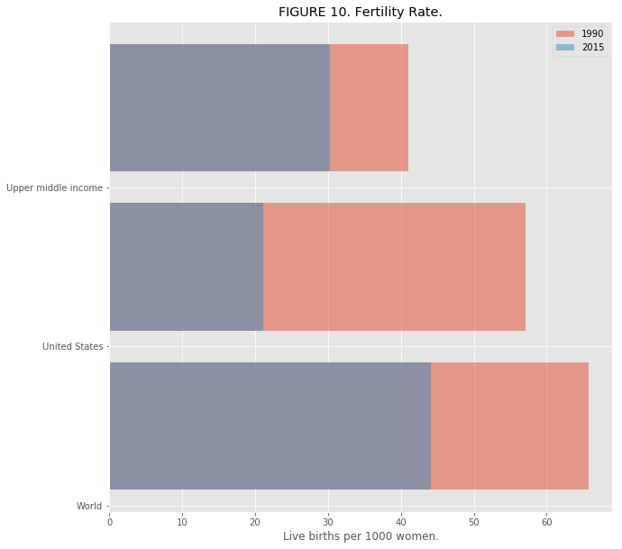


Fertility rate is not the same as the birth rate. While fertility rate is a parameter of females in the reproductive age and average number of children born within that range, birth rate is a parameter of live births in the entire population, without age limits. 

Therefore, the birth rate was compared to fertility rate within United States between 1990 and 2015. Line plot method was used for this type of analysis. As shown in Figure 11, significant drop started to occur around 2010 and then continued to decline, for both, fertility rate and birth rate.


```python
#code
birth_rate = pd.read_csv('birth_rate.csv')
birth_rate = birth_rate[0:26]
birth_rate.head()
```


<div>
<style>
    .dataframe thead tr:only-child th {
        text-align: right;
    }

    .dataframe thead th {
        text-align: left;
    }

    .dataframe tbody tr th {
        vertical-align: top;
    }
</style>
<table border="1" class="dataframe">
  <thead>
    <tr style="text-align: right;">
      <th></th>
      <th>Year</th>
      <th>Birth Number</th>
      <th>General Fertility Rate</th>
      <th>Crude Birth Rate</th>
    </tr>
  </thead>
  <tbody>
    <tr>
      <th>0</th>
      <td>2015</td>
      <td>3978497</td>
      <td>62.5</td>
      <td>12.4</td>
    </tr>
    <tr>
      <th>1</th>
      <td>2014</td>
      <td>3988076</td>
      <td>62.9</td>
      <td>12.5</td>
    </tr>
    <tr>
      <th>2</th>
      <td>2013</td>
      <td>3932181</td>
      <td>62.5</td>
      <td>12.4</td>
    </tr>
    <tr>
      <th>3</th>
      <td>2012</td>
      <td>3952841</td>
      <td>63.0</td>
      <td>12.6</td>
    </tr>
    <tr>
      <th>4</th>
      <td>2011</td>
      <td>3953590</td>
      <td>63.2</td>
      <td>12.7</td>
    </tr>
  </tbody>
</table>
</div>


```python
#fig11

x = birth_rate['Year']
y = birth_rate['Crude Birth Rate']
y2 = birth_rate['General Fertility Rate']

plt.figure(figsize=(10,10))


plt.plot(x,y,label='Crude Birth Rate')
plt.plot(x,y2,label='General Fertility Rate')

plt.title('FIGURE 11. Births and Fertility Rates in USA 1990-2015.')


plt.xlabel("Year")
plt.ylabel("Birth Rate")
plt.legend()

plt.show()
```


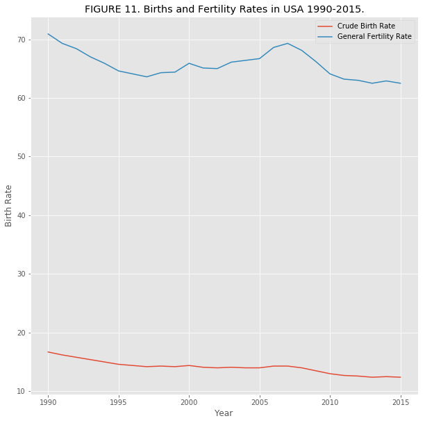


To magnify the birth rate and get better details isolated birth rate was rendered in the code below. As shown in figure 12, since 1990, the lowest birth rate was in 1998 and highest in 2007.


```python
#code
y3 = birth_rate['Birth Number']

plt.figure(figsize=(10,10))


plt.plot(x,y3,label='Birth Number')

plt.xlabel("Year")
plt.ylabel("Lve Births")

plt.legend()
plt.title('FIGURE 12. Live Births Number in USA 1990-2015.')
plt.show()
```


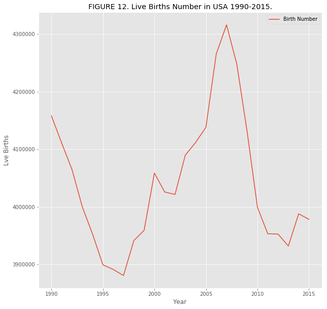


Next, to undestand the medical improvement the infant death rate was compared between 3 variables, world middle class rate, United States and upper middle income class countries. The data was adjusted and another line graph was executed. As shown in Figure 13, there was a major drop in infant deaths, and United states seems to have a line without much change.


```python
infant_mortality = pd.read_csv('infant_death.csv')
infants_rate_world = infant_mortality[257:258]
infants_rate_usa =  infant_mortality[249:250]
infants_rate_upper_middle_income = infant_mortality[247:248]
infants_rate_comparison = infants_rate_world.append(infants_rate_usa).append(infants_rate_upper_middle_income)
infants_rate_comparison 
```


<div>
<style>
    .dataframe thead tr:only-child th {
        text-align: right;
    }

    .dataframe thead th {
        text-align: left;
    }

    .dataframe tbody tr th {
        vertical-align: top;
    }
</style>
<table border="1" class="dataframe">
  <thead>
    <tr style="text-align: right;">
      <th></th>
      <th>Country Name</th>
      <th>Country Code</th>
      <th>Indicator Name</th>
      <th>Indicator Code</th>
      <th>1960</th>
      <th>1961</th>
      <th>1962</th>
      <th>1963</th>
      <th>1964</th>
      <th>1965</th>
      <th>...</th>
      <th>2008</th>
      <th>2009</th>
      <th>2010</th>
      <th>2011</th>
      <th>2012</th>
      <th>2013</th>
      <th>2014</th>
      <th>2015</th>
      <th>2016</th>
      <th>2017</th>
    </tr>
  </thead>
  <tbody>
    <tr>
      <th>257</th>
      <td>World</td>
      <td>WLD</td>
      <td>Number of infant deaths</td>
      <td>SH.DTH.IMRT</td>
      <td>NaN</td>
      <td>NaN</td>
      <td>NaN</td>
      <td>NaN</td>
      <td>NaN</td>
      <td>NaN</td>
      <td>...</td>
      <td>5444784.0</td>
      <td>5273662.0</td>
      <td>5114100.0</td>
      <td>4947463.0</td>
      <td>4794390.0</td>
      <td>4645354.0</td>
      <td>4500787.0</td>
      <td>4368315.0</td>
      <td>4242475.0</td>
      <td>NaN</td>
    </tr>
    <tr>
      <th>249</th>
      <td>United States</td>
      <td>USA</td>
      <td>Number of infant deaths</td>
      <td>SH.DTH.IMRT</td>
      <td>109375.0</td>
      <td>106140.0</td>
      <td>102538.0</td>
      <td>98664.0</td>
      <td>94234.0</td>
      <td>90170.0</td>
      <td>...</td>
      <td>26767.0</td>
      <td>26189.0</td>
      <td>25154.0</td>
      <td>24525.0</td>
      <td>23941.0</td>
      <td>23438.0</td>
      <td>23033.0</td>
      <td>22726.0</td>
      <td>22500.0</td>
      <td>NaN</td>
    </tr>
    <tr>
      <th>247</th>
      <td>Upper middle income</td>
      <td>UMC</td>
      <td>Number of infant deaths</td>
      <td>SH.DTH.IMRT</td>
      <td>NaN</td>
      <td>NaN</td>
      <td>NaN</td>
      <td>NaN</td>
      <td>NaN</td>
      <td>NaN</td>
      <td>...</td>
      <td>646498.0</td>
      <td>614708.0</td>
      <td>585387.0</td>
      <td>560825.0</td>
      <td>537206.0</td>
      <td>511776.0</td>
      <td>487265.0</td>
      <td>464102.0</td>
      <td>439176.0</td>
      <td>NaN</td>
    </tr>
  </tbody>
</table>
<p>3 rows × 62 columns</p>
</div>


```python
#fig13

x = ['1990', '2015']
y = ['8786769', '4368315']
y2 = ['37021','22726']
y3 = ['1935971','464102.0']

plt.figure(figsize=(10,10))

plt.plot(x,y,label='World Rate')
plt.plot(x,y2,label='USA Rate')
plt.plot(x,y3,label='World Middle Class')


plt.title('FIGURE 13. Infant Death Rates in 1990 vs 2015.')

plt.xlabel("Year")
plt.ylabel("Infant Deaths Rate")
plt.legend()

plt.show()
```


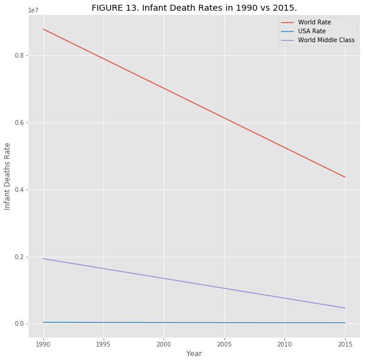


To understand the infant deaths in United states, another line plot was created with only one variable, United States. As shown in Figure 14, there was an improvement in United States.


```python
#fig 14

x = ['1990', '2015']
y2 = ['37021','22726']

plt.figure(figsize=(10,10))


plt.plot(x,y2,label='USA Rate')

plt.title('FIGURE 14. Infant Death Rates in 1990 vs 2015')

plt.xlabel("Year")
plt.ylabel("Death Rate")
plt.legend()

plt.show()
```


The next logical step was to identify doctors performance and overall improvement. The only tie period when full statistics were available is between 2000 and 2013. Skilled doctors rate was compared between 3 variables, world middle class rate, United States and upper middle income class countries. As shown in Figure 15, skilled doctors in United States actually declined while all other countries increased.


```python
#code
skilled_doctors = pd.read_csv('skilled_doctors.csv')
skilled_doctors_world = skilled_doctors[257:258]
skilled_doctors_usa = skilled_doctors[249:250]
skilled_doctors_middle = skilled_doctors[247:248]
skilled_doctors_comparison = skilled_doctors_world.append(skilled_doctors_usa).append(skilled_doctors_middle)
skilled_doctors_comparison
```


<div>
<style>
    .dataframe thead tr:only-child th {
        text-align: right;
    }

    .dataframe thead th {
        text-align: left;
    }

    .dataframe tbody tr th {
        vertical-align: top;
    }
</style>
<table border="1" class="dataframe">
  <thead>
    <tr style="text-align: right;">
      <th></th>
      <th>Country Name</th>
      <th>Country Code</th>
      <th>Indicator Name</th>
      <th>Indicator Code</th>
      <th>1960</th>
      <th>1961</th>
      <th>1962</th>
      <th>1963</th>
      <th>1964</th>
      <th>1965</th>
      <th>...</th>
      <th>2008</th>
      <th>2009</th>
      <th>2010</th>
      <th>2011</th>
      <th>2012</th>
      <th>2013</th>
      <th>2014</th>
      <th>2015</th>
      <th>2016</th>
      <th>2017</th>
    </tr>
  </thead>
  <tbody>
    <tr>
      <th>257</th>
      <td>World</td>
      <td>WLD</td>
      <td>Births attended by skilled health staff (% of ...</td>
      <td>SH.STA.BRTC.ZS</td>
      <td>NaN</td>
      <td>NaN</td>
      <td>NaN</td>
      <td>NaN</td>
      <td>NaN</td>
      <td>NaN</td>
      <td>...</td>
      <td>NaN</td>
      <td>NaN</td>
      <td>NaN</td>
      <td>NaN</td>
      <td>NaN</td>
      <td>78.330595</td>
      <td>NaN</td>
      <td>NaN</td>
      <td>NaN</td>
      <td>NaN</td>
    </tr>
    <tr>
      <th>249</th>
      <td>United States</td>
      <td>USA</td>
      <td>Births attended by skilled health staff (% of ...</td>
      <td>SH.STA.BRTC.ZS</td>
      <td>NaN</td>
      <td>NaN</td>
      <td>NaN</td>
      <td>NaN</td>
      <td>NaN</td>
      <td>NaN</td>
      <td>...</td>
      <td>99.3</td>
      <td>99.3</td>
      <td>99.4</td>
      <td>99.3</td>
      <td>99.3</td>
      <td>99.200000</td>
      <td>98.5</td>
      <td>NaN</td>
      <td>NaN</td>
      <td>NaN</td>
    </tr>
    <tr>
      <th>247</th>
      <td>Upper middle income</td>
      <td>UMC</td>
      <td>Births attended by skilled health staff (% of ...</td>
      <td>SH.STA.BRTC.ZS</td>
      <td>NaN</td>
      <td>NaN</td>
      <td>NaN</td>
      <td>NaN</td>
      <td>NaN</td>
      <td>NaN</td>
      <td>...</td>
      <td>NaN</td>
      <td>NaN</td>
      <td>NaN</td>
      <td>NaN</td>
      <td>NaN</td>
      <td>98.302861</td>
      <td>NaN</td>
      <td>NaN</td>
      <td>NaN</td>
      <td>NaN</td>
    </tr>
  </tbody>
</table>
<p>3 rows × 62 columns</p>
</div>


```python
#fig 15

x = ['2000', '2013']
y = ['62.817647', '78.330595']
y2 = ['99.4','99.2' ]
y3 = ['93.497474',' 98.302861' ]

plt.figure(figsize=(10,10))


plt.plot(x,y,label='World Rate')
plt.title('FIGURE 15. Births attended by skilled staff 2000 vs 2013.')

plt.plot(x,y2,label='USA Rate')
plt.plot(x,y3,label='Middle Class Rate')


plt.xlabel("Year")
plt.ylabel("Rate")
plt.legend()

plt.show()
```


Due to a large variety of worlwide data it's hard to identify maternal mortality causes in United States by comparing with other countries. Therefore, maternal mortality rate between states in United States were compared. The Maternal mortality rate is the yearly number of female deaths per 100,000 live births from any cause related to pregnancy. For this analysis, horizonal bar chart method was executed. It provided very clear comparison between each state. As shown in Figure 16, District of Columbia, Georgia and New Jersey, are the top 3 states with highest maternal mortality rates. The average in United states is 19 as for example compared to District of Columbia where it is 40.


```python
#code
maternal_mortality_by_state = pd.read_csv('maternal_mortalilty_states.csv')
maternal_mortality_by_state.head()
```


<div>
<style>
    .dataframe thead tr:only-child th {
        text-align: right;
    }

    .dataframe thead th {
        text-align: left;
    }

    .dataframe tbody tr th {
        vertical-align: top;
    }
</style>
<table border="1" class="dataframe">
  <thead>
    <tr style="text-align: right;">
      <th></th>
      <th>Year</th>
      <th>Code</th>
      <th>State</th>
      <th>Rank</th>
      <th>Rate</th>
    </tr>
  </thead>
  <tbody>
    <tr>
      <th>0</th>
      <td>2016</td>
      <td>Maternal Mortality</td>
      <td>Alabama</td>
      <td>5</td>
      <td>9.8</td>
    </tr>
    <tr>
      <th>1</th>
      <td>2016</td>
      <td>Maternal Mortality</td>
      <td>Alaska</td>
      <td>0</td>
      <td>0.0</td>
    </tr>
    <tr>
      <th>2</th>
      <td>2016</td>
      <td>Maternal Mortality</td>
      <td>Arizona</td>
      <td>23</td>
      <td>18.3</td>
    </tr>
    <tr>
      <th>3</th>
      <td>2016</td>
      <td>Maternal Mortality</td>
      <td>Arkansas</td>
      <td>46</td>
      <td>35.4</td>
    </tr>
    <tr>
      <th>4</th>
      <td>2016</td>
      <td>Maternal Mortality</td>
      <td>California</td>
      <td>2</td>
      <td>5.9</td>
    </tr>
  </tbody>
</table>
</div>


```python
maternal_mortality_by_state['Rate'].mean()
```


    19.328846153846154


```python
#fig 16

objects = (maternal_mortality_by_state['State'])
y_pos = np.arange(len(objects))
plt.figure(figsize=(10,10))


performance = maternal_mortality_by_state['Rate']
plt.figure(figsize=(10,10))
plt.barh(y_pos, performance,align='center', alpha=0.5)
plt.yticks(y_pos, objects)
plt.xlabel('Rate')
plt.title('FIGURE 16. Maternal Mortality by State.')

plt.show()
```


    <matplotlib.figure.Figure at 0x11e4bf5f8>


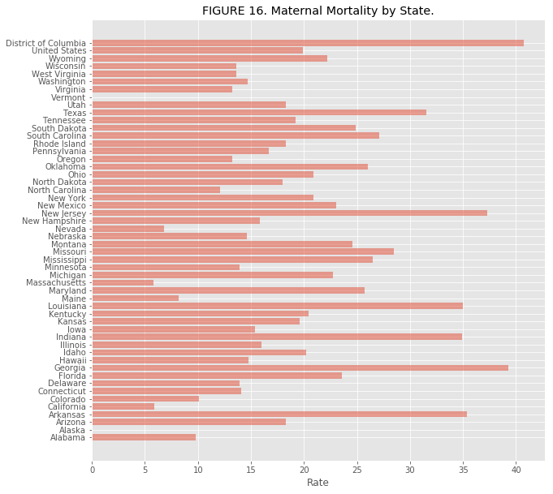


To get even better visualization a scatter plot was created by using Plotly online application. Then the code was  embedded into the Jupiter Notebook. As shown in Figure 17, rendered interactive scatter plot with hovers and colored by rates and density with gradient measurement bar, makes the visualization easy to understand and much more visually appealing.


```python
#code
import IPython
iframe = '<iframe width="900" height="800" frameborder="0" scrolling="no" src="//plot.ly/~ekirzhner/6.embed"></iframe>'
IPython.display.HTML(iframe)
```


<iframe width="900" height="800" frameborder="0" scrolling="no" src="//plot.ly/~ekirzhner/6.embed"></iframe>


Next, to undestand the health and habits during pregnancy, alcohol consumption during pregnancy was compared between different states. The bar chart represents what ercentage of pregnant women are having at least one alcoholic beverage in the past 30 days. Again, as shown in Figure 18, District of Columbia stands out with the highest rate of almost 30 percent.


```python
#code
pregnany_alcohol = pd.read_csv('maternal_death_by_state.csv')
alcohol_by_state = pregnany_alcohol [260:312]
alcohol_by_state.head()
```


<div>
<style>
    .dataframe thead tr:only-child th {
        text-align: right;
    }

    .dataframe thead th {
        text-align: left;
    }

    .dataframe tbody tr th {
        vertical-align: top;
    }
</style>
<table border="1" class="dataframe">
  <thead>
    <tr style="text-align: right;">
      <th></th>
      <th>Edition</th>
      <th>Report Type</th>
      <th>Measure Name</th>
      <th>State Name</th>
      <th>Rank</th>
      <th>Value</th>
      <th>Score</th>
      <th>Lower CI</th>
      <th>Upper CI</th>
      <th>Source</th>
      <th>Source Year</th>
    </tr>
  </thead>
  <tbody>
    <tr>
      <th>260</th>
      <td>2016</td>
      <td>Maternal &amp; Child Health</td>
      <td>Alcohol During Pregnancy</td>
      <td>Alabama</td>
      <td>16.0</td>
      <td>7.3</td>
      <td>-0.74</td>
      <td>12.2</td>
      <td>2.4</td>
      <td>CDC, Behavioral Risk Factor Surveillance System</td>
      <td>2011-2014</td>
    </tr>
    <tr>
      <th>261</th>
      <td>2016</td>
      <td>Maternal &amp; Child Health</td>
      <td>Alcohol During Pregnancy</td>
      <td>Alaska</td>
      <td>10.0</td>
      <td>6.2</td>
      <td>-1.04</td>
      <td>10.8</td>
      <td>1.6</td>
      <td>CDC, Behavioral Risk Factor Surveillance System</td>
      <td>2011-2014</td>
    </tr>
    <tr>
      <th>262</th>
      <td>2016</td>
      <td>Maternal &amp; Child Health</td>
      <td>Alcohol During Pregnancy</td>
      <td>Arizona</td>
      <td>24.0</td>
      <td>9.3</td>
      <td>-0.19</td>
      <td>15.2</td>
      <td>3.5</td>
      <td>CDC, Behavioral Risk Factor Surveillance System</td>
      <td>2011-2014</td>
    </tr>
    <tr>
      <th>263</th>
      <td>2016</td>
      <td>Maternal &amp; Child Health</td>
      <td>Alcohol During Pregnancy</td>
      <td>Arkansas</td>
      <td>25.0</td>
      <td>9.5</td>
      <td>-0.14</td>
      <td>19.0</td>
      <td>-0.1</td>
      <td>CDC, Behavioral Risk Factor Surveillance System</td>
      <td>2011-2014</td>
    </tr>
    <tr>
      <th>264</th>
      <td>2016</td>
      <td>Maternal &amp; Child Health</td>
      <td>Alcohol During Pregnancy</td>
      <td>California</td>
      <td>40.0</td>
      <td>13.4</td>
      <td>0.93</td>
      <td>18.6</td>
      <td>8.3</td>
      <td>CDC, Behavioral Risk Factor Surveillance System</td>
      <td>2011-2014</td>
    </tr>
  </tbody>
</table>
</div>


```python
#fig 18

objects = (alcohol_by_state['State Name'])
y_pos = np.arange(len(objects))
performance = alcohol_by_state['Value']
plt.figure(figsize=(10,10))
plt.barh(y_pos, performance,align='center', alpha=0.5)
plt.yticks(y_pos, objects)
plt.xlabel('Percent')
plt.title('FIGURE 18. Alcohol Consumption During Pregnancy')

plt.show()
```


After that percentage of pregnant women who are smokers were compared by states. Different color was being used to differentiate the category. This time, as shown in Figure 19, West Virginia stands out with the highest rate of almost 25 percent.


```python
#fig 19

smoking = pd.read_csv('smoking.csv')


objects = smoking['State']
y_pos = np.arange(len(objects))
width = .1

smoking = (smoking['Rate'])


plt.figure(figsize=(10,10))

plt.barh(y_pos +width, smoking, align='center', color = 'grey' , label='smoking')


plt.yticks(y_pos, objects)
plt.xlabel('Rate')
plt.title('FIGURE 19. Pregnant Women Who Are Smoker During Pregnancy')

plt.legend()

plt.show()
```


Then, percentage of women who reported that their health is very good or excellent was being compared. Interestingly enoughs, as shown in Figure 20, District of Columbia stands out with the highest rate of around 70 percent.


```python
#code
women_health_by_state_urban = pd.read_csv('women_health_urban.csv')
women_health_by_state_urban.head()
```


<div>
<style>
    .dataframe thead tr:only-child th {
        text-align: right;
    }

    .dataframe thead th {
        text-align: left;
    }

    .dataframe tbody tr th {
        vertical-align: top;
    }
</style>
<table border="1" class="dataframe">
  <thead>
    <tr style="text-align: right;">
      <th></th>
      <th>Health Status</th>
      <th>State</th>
      <th>Rate</th>
    </tr>
  </thead>
  <tbody>
    <tr>
      <th>0</th>
      <td>Health Status - Women - Urban</td>
      <td>Alabama</td>
      <td>48.0</td>
    </tr>
    <tr>
      <th>1</th>
      <td>Health Status - Women - Urban</td>
      <td>Alaska</td>
      <td>59.9</td>
    </tr>
    <tr>
      <th>2</th>
      <td>Health Status - Women - Urban</td>
      <td>Arizona</td>
      <td>58.0</td>
    </tr>
    <tr>
      <th>3</th>
      <td>Health Status - Women - Urban</td>
      <td>Arkansas</td>
      <td>51.4</td>
    </tr>
    <tr>
      <th>4</th>
      <td>Health Status - Women - Urban</td>
      <td>California</td>
      <td>54.7</td>
    </tr>
  </tbody>
</table>
</div>


```python
#fig20

objects = (women_health_by_state_urban['State'])
y_pos = np.arange(len(objects))
width = .1

health_by_state = (women_health_by_state_urban['Rate'])


plt.figure(figsize=(10,10))

plt.barh(y_pos +width, health_by_state, align='center', color = '#add8e6' , label='Health Status Rating')

plt.yticks(y_pos, objects)
plt.xlabel('Percentage')
plt.title('FIGURE 20. Women Reported Being In Good Health By State.')

plt.legend()

plt.show()
```


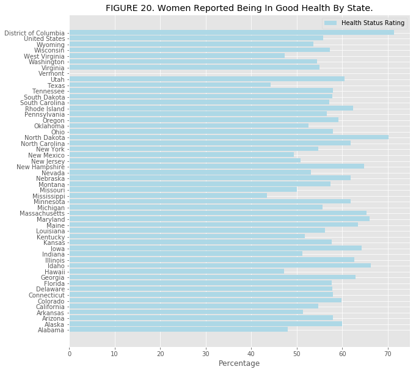


Mental distress between states was compared next. The bar chart shows percentage of women who reported their mental health was not good. As shown in Figure 21, the highest mental distress is in Arkansas, almost 20 percent.


```python
#code
mental_distress = pd.read_csv('mental_distress.csv')
mental_distress.head()
```


<div>
<style>
    .dataframe thead tr:only-child th {
        text-align: right;
    }

    .dataframe thead th {
        text-align: left;
    }

    .dataframe tbody tr th {
        vertical-align: top;
    }
</style>
<table border="1" class="dataframe">
  <thead>
    <tr style="text-align: right;">
      <th></th>
      <th>Condition</th>
      <th>State</th>
      <th>Rank</th>
      <th>Rate</th>
    </tr>
  </thead>
  <tbody>
    <tr>
      <th>0</th>
      <td>Frequent Mental Distress - Women</td>
      <td>Alabama</td>
      <td>49.0</td>
      <td>19.1</td>
    </tr>
    <tr>
      <th>1</th>
      <td>Frequent Mental Distress - Women</td>
      <td>Alaska</td>
      <td>9.0</td>
      <td>12.3</td>
    </tr>
    <tr>
      <th>2</th>
      <td>Frequent Mental Distress - Women</td>
      <td>Arizona</td>
      <td>35.0</td>
      <td>15.7</td>
    </tr>
    <tr>
      <th>3</th>
      <td>Frequent Mental Distress - Women</td>
      <td>Arkansas</td>
      <td>50.0</td>
      <td>19.3</td>
    </tr>
    <tr>
      <th>4</th>
      <td>Frequent Mental Distress - Women</td>
      <td>California</td>
      <td>14.0</td>
      <td>12.7</td>
    </tr>
  </tbody>
</table>
</div>


```python
#fig 21

mental_distress = pd.read_csv('mental_distress.csv')
objects = (mental_distress['State'])
y_pos = np.arange(len(objects))
width = 2

mental_distress = (mental_distress['Rate'])

plt.figure(figsize=(10,10))


plt.barh(y_pos , mental_distress, align='center',   color = '#A9A9A9' , label='Mental Distress Rating ')


plt.yticks(y_pos, objects)
plt.xlabel('Percentage')
plt.title('FIGURE 21. Mental Distress Rating.')

plt.legend()

plt.show()
```


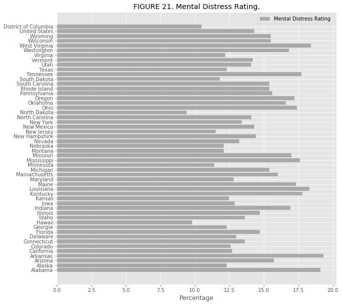


To get an idea or to identify a leading factor, or any correlating factor, maternal mortality ratio was compared with mental distress, health and alcohol consumtion during pregnancy. Horizontal bar chart colored by categories was excecuted. Based on Figure 22, Disctrict of Columbia, New Jersey and Georgia, had some highest correlation between these categories. 


```python
#fig22

mental_distress = pd.read_csv('mental_distress.csv')

objects = (women_health_by_state_urban['State'])
y_pos = np.arange(len(objects))
width = 2

health_by_state = (women_health_by_state_urban['Rate'])
mental_distress = (mental_distress['Rate'])
state_alchohol = (alcohol_by_state['Value'])
mortality_state = (maternal_mortality_by_state['Rate'])


plt.figure(figsize=(10,10))

plt.barh(y_pos , health_by_state, align='center', color = '#add8e6' , label='Health Status Rating')
plt.barh(y_pos, mortality_state, align='center',label='Maternal Mortality By State')
plt.barh(y_pos , mental_distress, align='center',   color = '#A9A9A9' , label='Mental Distress Rating ')
plt.barh(y_pos , state_alchohol, align='center',   color = 'blue' , label='Alcohol During Pregnancy Rating ')


plt.yticks(y_pos, objects)
plt.xlabel('Ratio')
plt.title('FIGURE 22. Maternal Mortality vs Alcohol Consumption vs Mental Distress vs Health By State')

plt.legend()

plt.show()
```


To continue on the further study of women's heath within states. Analysis was conducted on percentage of women who were told by a health professional that they have high blood pressure was visualized by using the same bar chart method. As shown in Figure 23, the highest blood pressure was identified in Louisiana at almost 20 percent.


```python
#fig23

high_blood_pressure = pd.read_csv('high_blood_pressure.csv')

objects = (high_blood_pressure['State'])
y_pos = np.arange(len(objects))
width = 2

high_blood_pressure = high_blood_pressure['Rate']

plt.figure(figsize=(10,10))

plt.barh(y_pos ,high_blood_pressure, align='center', color = 'red' , label='High Blood Pressure')

plt.yticks(y_pos, objects)
plt.xlabel('Percentage')
plt.title('FIGURE 23. High Blood Pressure By State')

plt.legend()

plt.show()
```


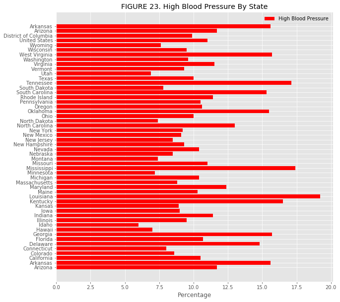


Next, precentage of women with diabetes was compared by states with the same bar chart method. As shown in Figure 24, Alabama and Missisippi have highest percentage of diabetes in women.


```python
#fig24

diabetes = pd.read_csv('diabetes.csv')

objects = diabetes['State']
y_pos = np.arange(len(objects))
width = .1

diabetes = diabetes['Rate']

plt.figure(figsize=(10,10))

plt.barh(y_pos +width, diabetes, align='center', color = 'brown' , label='diabetes')


plt.yticks(y_pos, objects)
plt.xlabel('Percentage')
plt.title('FIGURE 24. Diabetes By State.')

plt.legend()

plt.show()
```


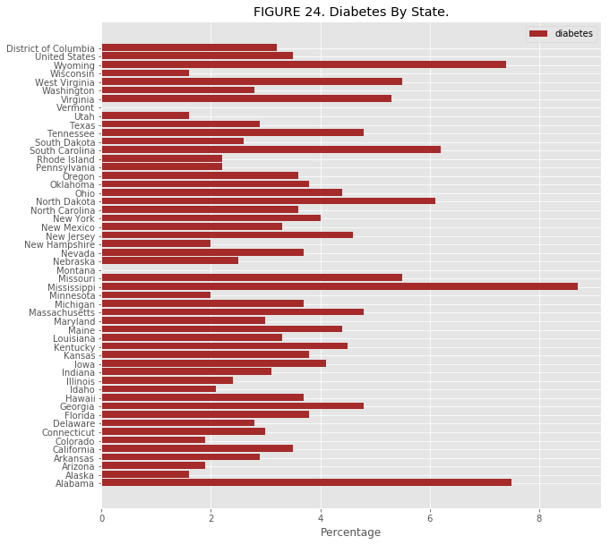


Obesity levels were compared next. Again, same method was used as previously, horizontal bar chart. As shown in Figure 25, Mississippi and Arkansas have the highest obisity rates at higher than 35 percent.


```python
#fig25

obesity = pd.read_csv('obesity.csv')

objects = obesity['State']
y_pos = np.arange(len(objects))
width = .1

obesity = obesity['Rate']

plt.figure(figsize=(10,10))

plt.barh(y_pos +width, obesity, align='center', color = 'grey' , label='obesity')


plt.yticks(y_pos, objects)
plt.xlabel('Percentage')
plt.title('FIGURE 25. Women Obesity in the United States.')

plt.legend()

plt.show()
```


Next, percentage of live births in which the mother received prenatal care before the 3rd trimester was observed. Same bar chart method was being used, as shown in Figure 26. District of Columbia	showed the smallest percentage of visits, which is 89 percent.


```python
#fig26

prenatal_care = pd.read_csv('prenetal_care.csv')

objects = prenatal_care['State']
y_pos = np.arange(len(objects))
width = .1

prenatal_care = prenatal_care['Rate']

plt.figure(figsize=(10,10))

plt.barh(y_pos +width, prenatal_care, align='center', color = 'pink' , label='prenatal care')


plt.yticks(y_pos, objects)
plt.xlabel('Percentage')
plt.title('FIGURE 26. Prenatal Care Visits Unites States.')

plt.legend()

plt.show()
```


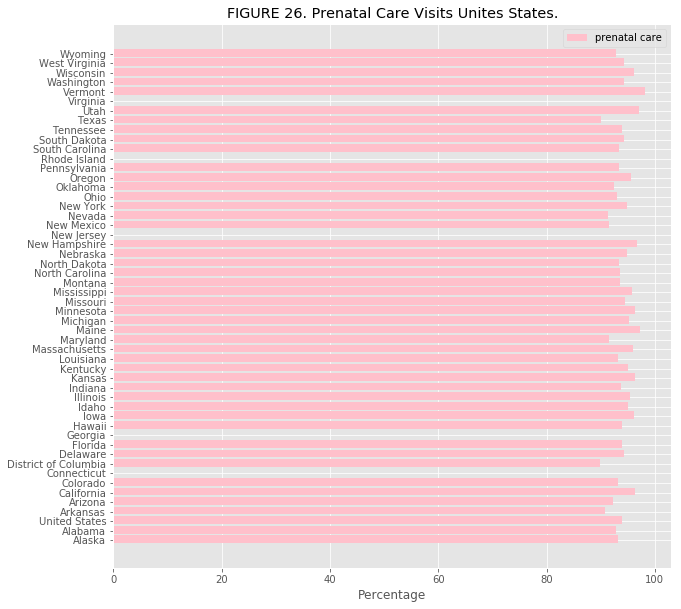


Combined data-sets of infant mortalities by 5 different ethnicities were compared. Plotly was used as a platform to excecute the bar chart and then embedded into the Jupiter Notebook. As shown in Figure 27, the highest infant mortality within black ethnicity in Wisconsin. 


```python
#fig 27
infant_mortality_asians = pd.read_csv('infant_mortality_asians.csv')
infant_mortality_indian_alaskan = pd.read_csv('infant_mortality_indian_alaskan.csv')
infant_mortality_white = pd.read_csv('infant_mortality_white.csv')
infant_mortality_hispanic = pd.read_csv('infant_mortality_hispanic.csv')
infant_mortality_black = pd.read_csv('infant_mortality_black.csv')

import IPython
iframe = '<iframe width="900" height="800" frameborder="0" scrolling="no" src="//plot.ly/~ekirzhner/12.embed"></iframe>'
IPython.display.HTML(iframe)
```


<iframe width="900" height="800" frameborder="0" scrolling="no" src="//plot.ly/~ekirzhner/12.embed"></iframe>


The data above didn't provide any insights or correlation between the leading factors or states. Therefore,to see if there is any similarities in the rate between child mortality and maternal mortality, another bar chart was excecuted. As shown in figure 28, the highest rate is in Missisippi and Louisiana, which is almost identical to their maternal mortality rate.


```python
#fig28

child_mortality = pd.read_csv('child_mortality.csv')

objects = (child_mortality['State'])
y_pos = np.arange(len(objects))
width = 2

child_mortality = (child_mortality['Rate'])
mortality_state = (maternal_mortality_by_state['Rate'])


plt.figure(figsize=(10,10))

plt.barh(y_pos, mortality_state, align='center', label='Maternal Mortality By State')
plt.barh(y_pos , child_mortality, align='center', color = '#5aacea' , label='Child Mortality By State')


plt.yticks(y_pos, objects)
plt.xlabel('Rate')
plt.title('FIGURE 28. Child Mortality vs Maternal Mortality')

plt.legend()

plt.show()
```


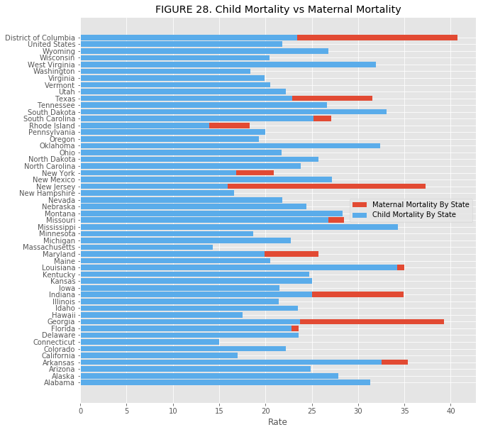


Next, percentage of women who are not covered by health insurance was analyzed. A simple bar chart method was used, as shown in Figure 29. Based on the analysis, it showed that Texas have highest rate of uninsured women, which is around 28 percent.


```python
#fig29

uninsured = pd.read_csv('uninsured.csv')
objects = uninsured ['State']
y_pos = np.arange(len(objects))
width = .1

uninsured  = uninsured ['Rate']

plt.figure(figsize=(10,10))

plt.barh(y_pos +width, uninsured , align='center', color = 'grey' , label='uninsured')


plt.yticks(y_pos, objects)
plt.xlabel('Percentage')
plt.title('FIGURE 29. Uninsured Women, United States')

plt.legend()

plt.show()
```


To understand the issues even better, ratio of homeless families was compared by states. Simple bar chart was used again, as shown in Figure 30. Based on the analysis, highest ratio of homeless people are in District of Columbia.


```python
#fig30

homeless_household = pd.read_csv('homeless_household.csv')

objects = homeless_household['State']
y_pos = np.arange(len(objects))
width = .1

homeless_household = homeless_household['Rate']

plt.figure(figsize=(10,10))

plt.barh(y_pos +width, homeless_household, align='center', color = 'grey' , label='homeless_household')


plt.yticks(y_pos, objects)
plt.xlabel('Homeless residents per 10,000 family households.')
plt.title('FIGURE 30. Homeless Residents')

plt.legend()

plt.show()
```


This was followed by analysis of  a new data-set. It was created and excecuted with modified information, where 3 states with highest problems and 3 states with lowest problems were identified, and traced in Plotly. Based on that information, interactive and vertical bar chart was created as shown in Figure 31. Each state had a colored bucket for each problem, where the tallest bar identified the most problematic state. Based on the analysis, it showed that Mississippi and District of Columbia have the most health living issues.


```python
#fig31
import IPython
iframe = '<iframe width="900" height="800" frameborder="0" scrolling="no" src="//plot.ly/~ekirzhner/21.embed"></iframe>'
IPython.display.HTML(iframe)

```


<iframe width="900" height="800" frameborder="0" scrolling="no" src="//plot.ly/~ekirzhner/21.embed"></iframe>


Based on that observation above, another dataframe was created within Plotly platform. It contained the states issues compared with 3 most problematic states and 3 states with the lowest issue rates. The dataframe was visualized by scatter plot chart, with data value assigned to each state. As it shows in Figure 32, leading issue that featured in District of Columbia by the biggest circle, is the homeless rate issue and then it shows the highest maternal mortality rate as well.


```python
import IPython
iframe = '<iframe width="900" height="800" frameborder="0" scrolling="no" src="//plot.ly/~ekirzhner/50.embed"></iframe>'
IPython.display.HTML(iframe)
```


<iframe width="900" height="800" frameborder="0" scrolling="no" src="//plot.ly/~ekirzhner/50.embed"></iframe>


Last chart that was exported within Plotly was a choropleth map. It was created by combining the sum of the values for each issue and then each state was assigned to it. Gradient colors were added to differentiate each state and provide better visualization as to which states are better compared to the worst by darker colors. As shown in Figure 33, California, Hawaii,Vancouver and Minnesota are one of the best states to have a safe pregnancy, meanwhile District of Columbis, Mississippi, Oklahoma and West Virgina are the worst and unsafe states.


```python
states_issues = pd.read_csv('states_issues.csv')
states_issues.sum(axis=1).head()
```


    0    148.1
    1    132.2
    2    135.9
    3    177.3
    4     95.2
    dtype: float64


```python
import IPython
iframe = '<iframe width="900" height="800" frameborder="0" scrolling="no" src="//plot.ly/~ekirzhner/55.embed"></iframe>'
IPython.display.HTML(iframe)
```


<iframe width="900" height="800" frameborder="0" scrolling="no" src="//plot.ly/~ekirzhner/55.embed"></iframe>


## Conclusion
It is alarming and unbelievable that in the 21st century women in United States are still dying in childbirth at increased rates. Pregnancy-related mortality findings should be studied and cross analyzed even more with the latest and advanced technology. It will provide a new view and value, resulting in clarification and better health management. 

Based on the project's research and analysis, it showed that the most disturbing leading factor were within District of Columbia. It showed the highest rates for the maternal mortality rates, homeless families, alchohol consumtion during pregnancy, and lowest prenetal doctor visitations. 

Additionally, the analysis showed that number of skilled doctors and birth rates are declining in United States.

Hopefully, this research will bring attention to the public and goverment institutions and prevent maternity deaths and what is causing them.

All these years, there was not enough information that was structured for deeper understanding and analysis. It can be improved. Big Data massively grows daily, useful information is everywhere around us.

Latest and fastest digital platforms have the ability to transform and improve the healthcare, store data and analyze huge mass of information from separate sources.

Doctors, medical staff and patients could use that information to improve and achieve better outcomes for pregnant mothers and prevent death. 

Various visualization methods have been demonstrated by using variety of datasets to plot simple bar charts, scatter plots and line graphs. By using most common techniques demonstrated here, Pandas with Python is the simplest method for basic plots. Plotly is the most useful, appealing and easiest option for creating web based highly interactive visualizations. 

Next step would be to identify how many lives could be saved by providing medical kits. Cost of providing medical kits compared to cost of death. With increase in availability of medical kits I expect to see decreased mortality rate and cost in hospitals that monitor and provide special care for pregnant mothers in need. Finally, further analyze states with highest mortality rate and compare with the ones that have lower rates and find out reasoning behind it.
